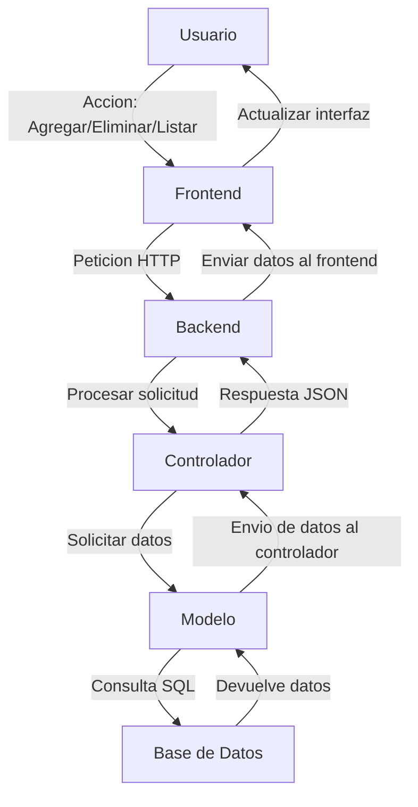

```mermaid
graph TD;
    A[Usuario] -->|Accion: Agregar/Eliminar/Listar| B[Frontend]
    B -->|Peticion HTTP| C[Backend]
    C -->|Procesar solicitud| D[Controlador]
    D -->|Solicitar datos| E[Modelo]
    E -->|Consulta SQL| F[Base de Datos]
    F -->|Devuelve datos| E
    E -->|Envio de datos al controlador| D
    D -->|Respuesta JSON| C
    C -->|Enviar datos al frontend| B
    B -->|Actualizar interfaz| A
```
